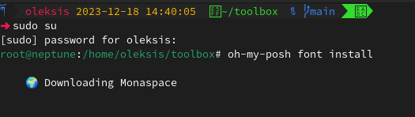
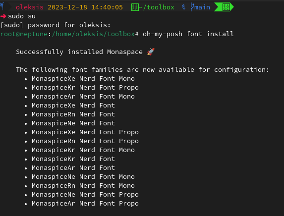
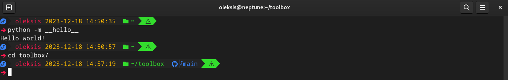
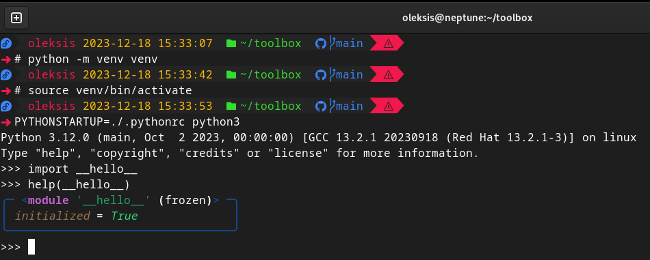

# toolbox
🧩 Developers Toolbox

|   |   |
|---|---|
|  |  |
|   |   |

## How to use

```bash
# Config git
git config --global user.name "Mona Lisa"
git config --global user.email "YOUR_EMAIL"
# Setting ohmyposh bashrc
ln -s ~/toolbox/.bashrc.d ~/.bashrc.d
## Opcional: Python venv, .pythonrc
python -m venv venv
source venv/bin/activate
PYTHONSTARTUP=./.pythonrc python3
```

## Gist

- [Instalar y Configurar Oh-My-Posh V3 y Posh Git](https://gist.github.com/oleksis/8a4f79f23dc9514e87fa252fefcee327#file-oh-my-posh_posh-git-md)
- [A .tmux.conf file for working with tmux ](https://gist.github.com/oleksis/d791880ec04180e2dc89dedb171e706b)
- [Setup Python Coding Environment on Windows](https://gist.github.com/oleksis/ae145fade455aae58c47e0295d2cf38d#file-bashrc)
- [Customize the Python REPL on start-up](https://gist.github.com/oleksis/d1cc378d3f8fae62f15627e3bc57de7f#pythonrc-file)
- [Pyenv and Python Launcher](https://gist.github.com/oleksis/7cab1772862df71f73ce22b7515f6af3#pyenv)
- [Pyenv and Tox](https://gist.github.com/oleksis/87b5726e73e62f3e5c8cfb585d7fe4e9#how-to-configure-tox-and-pyenv)

